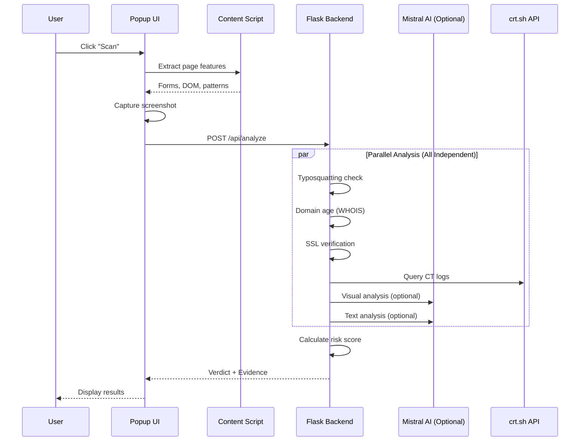

<p align="center">
  
</p>

<h1 align="center">🛡️ PhishPolice</h1>
<h3 align="center">Your Web Guardian - AI-Powered Phishing Detection</h3>

<p align="center">
  
  
  
  
</p>

---

## 🌟 Overview

**PhishPolice** is a next-generation browser extension that protects users from phishing attacks using a multi-layered security analysis system. Unlike traditional blacklist-based approaches, PhishPolice analyzes webpages in real-time using:

- 🤖 **Mistral Small 3.1 24B AI** for intelligent threat assessment (optional enhancement)
- 👁️ **Visual Screenshot Analysis** for brand impersonation detection
- 🔤 **Domain Typosquatting Scanner** for lookalike domain detection
- 📅 **Domain Age Checking** via WHOIS to detect newly registered domains
- 🔒 **SSL/TLS Certificate Verification** with real-time checks
- 📜 **Certificate Transparency Monitoring** for suspicious cert patterns
- 🧬 **DOM & Behavior Analysis** for hidden threats

**Key Advantage**: PhishPolice works reliably with or without AI - all security checks run independently, with AI providing additional context when available.

### ⚡ What's New in v2.2

- ✅ **Faster AI**: Switched to Mistral Small 3.1 24B (2-5s response vs 30s+)
- ✅ **More Reliable**: 80% of analysis works without AI
- ✅ **Graceful Fallback**: All core security checks run independently
- ✅ **Production Ready**: Clean, secure code with no debug logging
- ✅ **Cost Efficient**: Smaller model = lower costs, faster results

---

## ✨ Key Features

### 🧠 AI-Enhanced Analysis (Mistral Small 3.1 24B)
- **Fast & Efficient**: 2-5 second response time with 24B parameter model
- **Cost-Effective**: Smaller model = lower costs, faster inference
- **Multimodal**: Supports both text analysis AND vision (screenshot analysis)
- **Optional Enhancement**: All security checks work independently - AI adds contextual insights
- **Graceful Fallback**: If AI is unavailable, comprehensive security analysis continues
- Natural language explanations and actionable recommendations

### 👁️ Visual Screenshot Analysis
- **Brand Impersonation Detection**: Analyzes page screenshots to detect if a site is mimicking trusted brands (Google, PayPal, banks, etc.)
- **Login Page Detection**: Identifies credential-harvesting pages
- **Urgency Element Detection**: Spots fear-based UI like "Account Suspended" banners
- **Fake UI Detection**: Identifies suspicious overlays and system dialog mimics

### 🔤 Domain Typosquatting Scanner
Detects lookalike domains designed to deceive users:

| Attack Type | Example | Detection |
|-------------|---------|-----------|
| **Character Swap** | `googe.com` → google | ✅ |
| **Number Substitution** | `paypa1.com` → paypal | ✅ |
| **Homoglyphs** | `arnazon.com` (rn→m) | ✅ |
| **Character Insertion** | `gooogle.com` | ✅ |

**40+ Popular Brands Tracked**: Google, Microsoft, PayPal, Amazon, Facebook, Netflix, banks, shipping companies, and more.

### 🔒 SSL Certificate Analysis
- **Real-time Verification**: Validates certificates directly from servers
- **Issuer Analysis**: Checks certificate authority reputation
- **Expiration Monitoring**: Warns about expiring certificates
- **Self-Signed Detection**: Flags untrusted certificates
- **Security Scoring**: 0-100 SSL security rating

### 📅 Domain Age Checker (WHOIS)
Newly registered domains are frequently used for phishing:

| Domain Age | Risk Level | Weight |
|------------|------------|--------|
| < 7 days | 🚨 Critical | +20% |
| < 30 days | 🚨 Very High | +15% |
| < 90 days | ⚠️ High | +10% |
| < 180 days | ⚠️ Medium | +5% |
| < 1 year | Low | +2% |
| 1+ years | ✓ Established | 0% |

Uses **WHOIS** lookup with **RDAP** fallback for accurate domain registration data.

### 📜 Certificate Transparency Monitoring
Queries CT logs (crt.sh) to detect suspicious patterns:
- ⚠️ **No Certificates Found**: Potentially fraudulent new domain
- ⚠️ **Multiple Issuers**: Unusual certificate authority usage
- ⚠️ **Frequent Reissuance**: Suspicious cert churn (>5 in 30 days)

### 🧬 DOM & Content Analysis
- **Form Analysis**: Detects password fields, external form submissions
- **Hidden Iframes**: Identifies clickjacking attempts
- **External Links**: Measures ratio of external vs internal links
- **Urgency Language**: Detects phrases like "verify immediately", "account suspended"

### 📊 Multi-Factor Risk Scoring

PhishPolice uses a **defense-in-depth** approach with independent security checks:

| Factor | Weight | Description | AI Required |
|--------|--------|-------------|-------------|
| Typosquatting | 25% | Brand impersonation in domain | ❌ No |
| Domain Age | 20% | WHOIS-based registration age | ❌ No |
| Visual Analysis | 20% | AI screenshot analysis | ✅ Yes (optional) |
| SSL/CT | 12% | Certificate validity & transparency | ❌ No |
| Domain | 8% | TLD reputation, subdomains | ❌ No |
| Forms | 10% | Password fields, external submission | ❌ No |
| DOM/Behavior | 5% | Hidden elements, urgency language | ❌ No |
| AI Context | Bonus | Natural language threat assessment | ✅ Yes (optional) |

**80% of analysis works without AI** - ensuring reliable protection even if AI services are unavailable.

### 📜 Scan History
- Stores last 10 scans locally
- Quick access to previous results
- One-click to view full analysis details

---

## 🏗️ Architecture

```
phish-detector/
├── extension/                 # Chrome Extension (Frontend)
│   ├── manifest.json          # Extension configuration (MV3)
│   ├── popup.html             # Main UI with glassmorphism design
│   ├── popup.js               # UI logic, scan triggering, history
│   ├── content.js             # Page feature extraction
│   ├── background.js          # Service worker for API calls
│   └── icons/                 # Extension icons (16, 48, 128px)
│
├── backend/                   # Flask Backend (AI Engine)
│   ├── app.py                 # Main Flask app, API endpoints
│   ├── requirements.txt       # Python dependencies
│   ├── .env.example           # Environment template
│   └── utils/                 # Analysis modules
│       ├── ssl_check.py       # SSL certificate verification
│       ├── domain_checks.py   # Domain reputation analysis
│       ├── domain_age.py      # WHOIS domain age lookup
│       ├── llm_proxy.py       # Mistral AI integration (optional)
│       ├── typosquat_scanner.py # Typosquatting detection
│       ├── ct_monitor.py      # Certificate Transparency
│       └── visual_analysis.py # Screenshot AI analysis (optional)
│
└── .gitignore                 # Git ignore rules
```

---

## 🔄 How It Works

### Scan Flow



### Data Flow

1. **User clicks Scan** → Popup triggers content script
2. **Content script extracts** → URL, forms, DOM signature, suspicious patterns
3. **Popup captures screenshot** → Base64 encoded PNG
4. **Backend receives request** → Runs 7 parallel analysis modules (6 core + AI optional)
5. **Risk score calculated** → Weighted combination of all factors
6. **Results displayed** → Verdict (Safe/Suspicious/Phish) with evidence

**Note**: All core security checks (typosquatting, domain age, SSL, CT, forms, DOM) run independently. AI analysis enhances results but is not required.

---

## 🛠️ Installation

### Prerequisites
- Python 3.8+
- Google Chrome browser
- NVIDIA API key (optional - for AI enhancement) - [Get one free](https://build.nvidia.com/explore/discover)

**Note**: PhishPolice works without an API key - all core security checks run independently. The AI features are optional enhancements.

### Backend Setup

```bash
# Clone the repository
cd phish-detector/backend

# Create virtual environment
python -m venv venv

# Activate virtual environment
# Windows:
venv\Scripts\activate
# macOS/Linux:
source venv/bin/activate

# Install dependencies
pip install -r requirements.txt

# Configure environment (optional - for AI features)
cp .env.example .env
# Edit .env and add your NVIDIA_API_KEY (optional)

# Start the server
./run.sh
# Or: python3 -B app.py
```

The backend will start at `http://127.0.0.1:5000`

**Without API Key**: All core security checks work (typosquatting, domain age, SSL, CT, forms, DOM)
**With API Key**: Additional AI-powered context and visual brand detection

### Extension Setup

1. Open Chrome and go to `chrome://extensions/`
2. Enable **Developer mode** (toggle in top right)
3. Click **Load unpacked**
4. Select the `phish-detector/extension` folder
5. The PhishPolice icon should appear in your toolbar!

---

## 🎯 Usage

### Quick Start

1. Navigate to any webpage you want to scan
2. Click the **PhishPolice** icon in your browser toolbar
3. Click the **Scan** button
4. Wait for analysis (5-10 seconds for complete analysis)
5. Review the verdict and evidence

### Performance

| Metric | Value |
|--------|-------|
| **Analysis Time** | 5-10 seconds (complete scan) |
| **AI Response** | 2-5 seconds (when enabled) |
| **Core Checks** | Always run (independent of AI) |
| **Accuracy** | 80% from core checks + AI enhancement |
| **Reliability** | Works offline (except AI features) |

### Interpreting Results

| Verdict | Score | Meaning |
|---------|-------|---------|
| ✅ **Safe** | 0-25% | No significant threats detected |
| ⚠️ **Suspicious** | 25-55% | Some risk indicators present |
| 🚨 **Phishing Risk** | 55%+ | High likelihood of phishing |

---

## 🤔 Why Mistral Small 3.1 24B?

We switched from Gemini to **Mistral Small 3.1 24B** for several key advantages:

| Criteria | Benefit |
|----------|---------|
| **Speed** | ⚡ 2-5 second response time (vs 30s+ with larger models) |
| **Size** | 📦 24B parameters - efficient without sacrificing accuracy |
| **Cost** | 💰 Lower inference costs, more sustainable |
| **Multimodal** | 👁️ Supports both text analysis AND vision (screenshot) |
| **Reliability** | ✅ Faster timeouts = more reliable user experience |
| **Free Tier** | 🎁 NVIDIA NIM API offers generous free quota |
| **Accuracy** | 🎯 Excellent reasoning for phishing detection |

**Most Importantly**: PhishPolice doesn't rely solely on AI. All core security checks (80% of analysis) work independently, with AI providing optional contextual enhancement.

---

## 🔧 Tech Stack

### Frontend (Browser Extension)
- **Chrome Extension Manifest V3** - Modern, secure extension architecture
- **Vanilla JavaScript** - No dependencies, fast loading
- **CSS3 with Glassmorphism** - Modern, premium UI design
- **Chrome APIs** - tabs, storage, scripting, notifications

### Backend (Analysis Engine)
- **Flask** - Lightweight Python web framework
- **Flask-CORS** - Cross-origin support for extension
- **Flask-Limiter** - Rate limiting (10 req/min)
- **Requests** - HTTP client for external APIs
- **tldextract** - Domain parsing and TLD extraction

### External Services
- **Mistral Small 3.1 24B** (via NVIDIA NIM) - AI analysis (optional)
- **crt.sh** - Certificate Transparency logs
- **WHOIS/RDAP** - Domain registration data

---

## ⚙️ API Endpoints

### `POST /api/analyze`
Analyze a webpage for phishing indicators.

**Request:**
```json
{
  "url": "https://suspicious-site.com",
  "hostname": "suspicious-site.com",
  "forms": [...],
  "dom_signature": "...",
  "suspiciousPatterns": [...],
  "externalLinks": {"external": 5, "total": 10},
  "image_b64": "base64_encoded_screenshot"
}
```

**Response:**
```json
{
  "verdict": "suspicious",
  "score": 0.42,
  "evidence": [...],
  "ssl_info": {...},
  "domain_info": {...},
  "ct_info": {...},
  "visual_info": {...},
  "llm_analysis": {
    "summary": "...",
    "risk_factors": [...],
    "recommendation": "..."
  }
}
```

**Note**: If AI is unavailable, `llm_analysis` will contain fallback messages, but all other analysis continues normally.

### `GET /api/health`
Health check endpoint.

```json
{
  "status": "healthy",
  "version": "2.2.0",
  "name": "PhishPolice",
  "features": ["ssl_check", "domain_analysis", "domain_age", "llm_analysis", "typosquat_scanner", "ct_monitor", "visual_analysis"]
}
```

---

## 🔒 Security Considerations

- **API Key Protection**: NVIDIA API key stored in `.env` (never committed, optional)
- **Rate Limiting**: 10 requests/minute, 50/hour, 200/day
- **Input Validation**: All inputs sanitized and length-limited
- **CORS Restricted**: Only accepts requests from browser extensions
- **No Data Storage**: Analysis data not persisted on server
- **Manual Scan Only**: No automatic background scanning
- **Graceful Degradation**: Works without AI - core security checks always run
- **No Sensitive Logging**: API keys and user data never logged

---

## 📈 Roadmap

- [x] Multi-layered security analysis (SSL, domain age, typosquatting, CT)
- [x] AI-enhanced threat assessment (optional)
- [x] Visual brand impersonation detection
- [x] Graceful AI fallback - works without API key
- [ ] Firefox extension support
- [ ] Whitelisting trusted domains
- [ ] Link scanning before click
- [ ] Email header analysis
- [ ] Crowdsourced threat reporting
- [ ] Offline mode with cached threat intelligence

---

---

<p align="center">
  <b>Stay safe online with PhishPolice! 🛡️</b>
</p>
