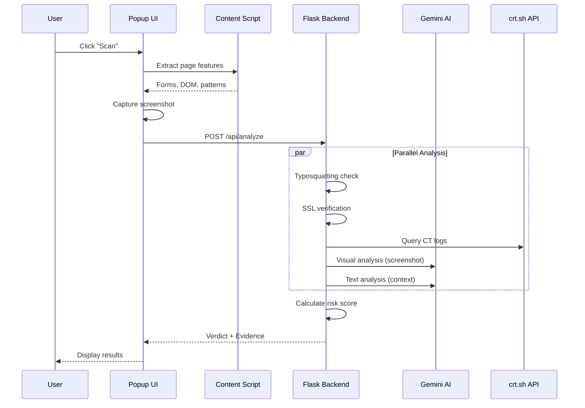

<p align="center">
  
</p>

<h1 align="center">🛡️ PhishPolice</h1>
<h3 align="center">Your Web Guardian - AI-Powered Phishing Detection</h3>

<p align="center">
  
  
  
  
</p>

---

## 🌟 Overview

**PhishPolice** is a next-generation browser extension that protects users from phishing attacks using a multi-layered AI-powered security analysis. Unlike traditional blacklist-based approaches, PhishPolice analyzes webpages in real-time using:

- 🤖 **Gemini 2.5 Flash Lite AI** for intelligent threat assessment
- 👁️ **Visual Screenshot Analysis** for brand impersonation detection
- 🔤 **Domain Typosquatting Scanner** for lookalike domain detection
- 📅 **Domain Age Checking** via WHOIS to detect newly registered domains
- 🔒 **SSL/TLS Certificate Verification** with real-time checks
- 📜 **Certificate Transparency Monitoring** for suspicious cert patterns
- 🧬 **DOM & Behavior Analysis** for hidden threats

---

## ✨ Key Features

### 🧠 AI-Powered Analysis (Gemini 2.5 Flash Lite)
- Real-time phishing risk assessment using Google's Gemini AI
- Contextual analysis of page content, forms, and behavior
- Natural language explanations and recommendations
- Low-latency, cost-efficient model optimized for security analysis

### 👁️ Visual Screenshot Analysis
- **Brand Impersonation Detection**: Analyzes page screenshots to detect if a site is mimicking trusted brands (Google, PayPal, banks, etc.)
- **Login Page Detection**: Identifies credential-harvesting pages
- **Urgency Element Detection**: Spots fear-based UI like "Account Suspended" banners
- **Fake UI Detection**: Identifies suspicious overlays and system dialog mimics

### 🔤 Domain Typosquatting Scanner
Detects lookalike domains designed to deceive users:

| Attack Type | Example | Detection |
|-------------|---------|-----------|
| **Character Swap** | `googe.com` → google | ✅ |
| **Number Substitution** | `paypa1.com` → paypal | ✅ |
| **Homoglyphs** | `arnazon.com` (rn→m) | ✅ |
| **Character Insertion** | `gooogle.com` | ✅ |

**40+ Popular Brands Tracked**: Google, Microsoft, PayPal, Amazon, Facebook, Netflix, banks, shipping companies, and more.

### 🔒 SSL Certificate Analysis
- **Real-time Verification**: Validates certificates directly from servers
- **Issuer Analysis**: Checks certificate authority reputation
- **Expiration Monitoring**: Warns about expiring certificates
- **Self-Signed Detection**: Flags untrusted certificates
- **Security Scoring**: 0-100 SSL security rating

### 📅 Domain Age Checker (WHOIS)
Newly registered domains are frequently used for phishing:

| Domain Age | Risk Level | Weight |
|------------|------------|--------|
| < 7 days | 🚨 Critical | +20% |
| < 30 days | 🚨 Very High | +15% |
| < 90 days | ⚠️ High | +10% |
| < 180 days | ⚠️ Medium | +5% |
| < 1 year | Low | +2% |
| 1+ years | ✓ Established | 0% |

Uses **WHOIS** lookup with **RDAP** fallback for accurate domain registration data.

### 📜 Certificate Transparency Monitoring
Queries CT logs (crt.sh) to detect suspicious patterns:
- ⚠️ **No Certificates Found**: Potentially fraudulent new domain
- ⚠️ **Multiple Issuers**: Unusual certificate authority usage
- ⚠️ **Frequent Reissuance**: Suspicious cert churn (>5 in 30 days)

### 🧬 DOM & Content Analysis
- **Form Analysis**: Detects password fields, external form submissions
- **Hidden Iframes**: Identifies clickjacking attempts
- **External Links**: Measures ratio of external vs internal links
- **Urgency Language**: Detects phrases like "verify immediately", "account suspended"

### 📊 Multi-Factor Risk Scoring

| Factor | Weight | Description |
|--------|--------|-------------|
| Typosquatting | 25% | Brand impersonation in domain |
| Domain Age | 20% | WHOIS-based registration age |
| Visual Analysis | 20% | AI screenshot analysis |
| SSL/CT | 12% | Certificate validity & transparency |
| Domain | 8% | TLD reputation, subdomains |
| Forms | 10% | Password fields, external submission |
| DOM/Behavior | 5% | Hidden elements, urgency language |

### 📜 Scan History
- Stores last 10 scans locally
- Quick access to previous results
- One-click to view full analysis details

---

## 🏗️ Architecture

```
phish-detector/
├── extension/                 # Chrome Extension (Frontend)
│   ├── manifest.json          # Extension configuration (MV3)
│   ├── popup.html             # Main UI with glassmorphism design
│   ├── popup.js               # UI logic, scan triggering, history
│   ├── content.js             # Page feature extraction
│   ├── background.js          # Service worker for API calls
│   └── icons/                 # Extension icons (16, 48, 128px)
│
├── backend/                   # Flask Backend (AI Engine)
│   ├── app.py                 # Main Flask app, API endpoints
│   ├── requirements.txt       # Python dependencies
│   ├── .env.example           # Environment template
│   └── utils/                 # Analysis modules
│       ├── ssl_check.py       # SSL certificate verification
│       ├── domain_checks.py   # Domain reputation analysis
│       ├── llm_proxy.py       # Gemini AI integration
│       ├── typosquat_scanner.py # Typosquatting detection
│       ├── ct_monitor.py      # Certificate Transparency
│       └── visual_analysis.py # Screenshot AI analysis
│
└── .gitignore                 # Git ignore rules
```

---

## 🔄 How It Works

### Scan Flow



### Data Flow

1. **User clicks Scan** → Popup triggers content script
2. **Content script extracts** → URL, forms, DOM signature, suspicious patterns
3. **Popup captures screenshot** → Base64 encoded PNG
4. **Backend receives request** → Runs 6 parallel analysis modules
5. **Risk score calculated** → Weighted combination of all factors
6. **Results displayed** → Verdict (Safe/Suspicious/Phish) with evidence

---

## 🛠️ Installation

### Prerequisites
- Python 3.8+
- Google Chrome browser
- Gemini API key ([Get one free](https://aistudio.google.com/app/apikey))

### Backend Setup

```bash
# Clone the repository
cd phish-detector/backend

# Create virtual environment
python -m venv venv

# Activate virtual environment
# Windows:
venv\Scripts\activate
# macOS/Linux:
source venv/bin/activate

# Install dependencies
pip install -r requirements.txt

# Configure environment
cp .env.example .env
# Edit .env and add your GEMINI_API_KEY

# Start the server
python app.py
```

The backend will start at `http://127.0.0.1:5000`

### Extension Setup

1. Open Chrome and go to `chrome://extensions/`
2. Enable **Developer mode** (toggle in top right)
3. Click **Load unpacked**
4. Select the `phish-detector/extension` folder
5. The PhishPolice icon should appear in your toolbar!

---

## 🎯 Usage

1. Navigate to any webpage you want to scan
2. Click the **PhishPolice** icon in your browser toolbar
3. Click the **Scan** button
4. Wait for analysis (10-30 seconds depending on page complexity)
5. Review the verdict and evidence

### Interpreting Results

| Verdict | Score | Meaning |
|---------|-------|---------|
| ✅ **Safe** | 0-25% | No significant threats detected |
| ⚠️ **Suspicious** | 25-55% | Some risk indicators present |
| 🚨 **Phishing Risk** | 55%+ | High likelihood of phishing |

---

## 🤔 Why Gemini 2.5 Flash Lite?

We chose **Gemini 2.5 Flash Lite** for several key reasons:

| Criteria | Benefit |
|----------|---------|
| **Speed** | ~1-2 second response time for security analysis |
| **Cost** | Lower token costs than full Flash model |
| **Multimodal** | Supports both text analysis AND vision (screenshot) |
| **Free Tier** | Generous free quota for personal use |
| **Accuracy** | State-of-the-art reasoning for phishing detection |
| **Context** | Large context window for complex page analysis |

---

## 🔧 Tech Stack

### Frontend (Browser Extension)
- **Chrome Extension Manifest V3** - Modern, secure extension architecture
- **Vanilla JavaScript** - No dependencies, fast loading
- **CSS3 with Glassmorphism** - Modern, premium UI design
- **Chrome APIs** - tabs, storage, scripting, notifications

### Backend (Analysis Engine)
- **Flask** - Lightweight Python web framework
- **Flask-CORS** - Cross-origin support for extension
- **Flask-Limiter** - Rate limiting (10 req/min)
- **Requests** - HTTP client for external APIs
- **tldextract** - Domain parsing and TLD extraction

### External Services
- **Gemini 2.5 Flash Lite** - AI analysis (text + vision)
- **crt.sh** - Certificate Transparency logs

---

## ⚙️ API Endpoints

### `POST /api/analyze`
Analyze a webpage for phishing indicators.

**Request:**
```json
{
  "url": "https://suspicious-site.com",
  "hostname": "suspicious-site.com",
  "forms": [...],
  "dom_signature": "...",
  "suspiciousPatterns": [...],
  "externalLinks": {"external": 5, "total": 10},
  "image_b64": "base64_encoded_screenshot"
}
```

**Response:**
```json
{
  "verdict": "suspicious",
  "score": 0.42,
  "evidence": [...],
  "ssl_info": {...},
  "domain_info": {...},
  "ct_info": {...},
  "visual_info": {...},
  "llm_analysis": {
    "summary": "...",
    "risk_factors": [...],
    "recommendation": "..."
  }
}
```

### `GET /api/health`
Health check endpoint.

```json
{
  "status": "healthy",
  "version": "2.1.0",
  "name": "PhishPolice",
  "features": ["ssl_check", "domain_analysis", "llm_analysis", "typosquat_scanner", "ct_monitor"]
}
```

---

## 🔒 Security Considerations

- **API Key Protection**: Gemini API key stored in `.env` (never committed)
- **Rate Limiting**: 10 requests/minute, 50/hour, 200/day
- **Input Validation**: All inputs sanitized and length-limited
- **CORS Restricted**: Only accepts requests from browser extensions
- **No Data Storage**: Analysis data not persisted on server
- **Manual Scan Only**: No automatic background scanning

---

## 📈 Roadmap

- [ ] Firefox extension support
- [ ] Whitelisting trusted domains
- [ ] Link scanning before click
- [ ] Email header analysis
- [ ] Crowdsourced threat reporting

---

---

<p align="center">
  <b>Stay safe online with PhishPolice! 🛡️</b>
</p>
